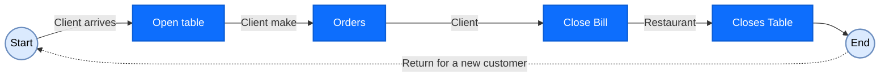

# 🍽️ Restaurant Management API

A RESTful API for restaurant management built with Node.js.

This project was developed to practice backend development concepts and provide a complete API structure for managing restaurants, menu items, orders, customers, and related operations.

The API follows REST principles and focuses on clean architecture, scalability, and maintainable code organization.

---

## 🚀 Features

This API allows you to:

* Manage restaurants
* Create and update menu items
* Register customers
* Create and manage orders
* Update order status
* Filter and list resources
* Handle JSON request bodies
* Work with route parameters and query strings
* Organize backend logic using modular architecture
* Persist and manipulate restaurant-related data

---

## 📚 Learning Objectives

During this project, the following backend development concepts were explored:

* REST API architecture
* HTTP methods (`GET`, `POST`, `PUT`, `PATCH`, `DELETE`)
* Request and response handling
* JSON data manipulation
* Route and query parameter handling
* CRUD operations
* Error handling and validation
* Node.js server structure
* Modular code organization
* Backend best practices

---

## 🛠️ Technologies Used

* Node.js
* JavaScript (ES6+)
* Native Node.js modules
* REST API concepts

---

## 🌀 Application Flow

The diagram below shows the basic workflow of the restaurant application.



---

## 📂 Project Structure

```bash
api-restaurant/
│
├── src/
│   ├── controllers/
│   ├── routes/
│   ├── services/
│   ├── database/
│   ├── utils/
│   └── server.js
│
├── package.json
└── README.md
```

---

## ⚙️ Installation

Clone the repository:

```bash
git clone https://github.com/Jujbraga/api-restaurant.git
```

Access the project folder:

```bash
cd api-restaurant
```

Install dependencies:

```bash
npm install
```

Start the development server:

```bash
npm run dev
```

Or start the production server:

```bash
npm start
```

---

## 🔥 API Endpoints

### Restaurants

#### Create Restaurant

```http
POST /restaurants
```

#### List Restaurants

```http
GET /restaurants
```

#### Get Restaurant By ID

```http
GET /restaurants/:id
```

#### Update Restaurant

```http
PUT /restaurants/:id
```

#### Delete Restaurant

```http
DELETE /restaurants/:id
```

---

### Menu

#### Create Menu Item

```http
POST /menu
```

#### List Menu Items

```http
GET /menu
```

#### Update Menu Item

```http
PUT /menu/:id
```

#### Delete Menu Item

```http
DELETE /menu/:id
```

---

### Orders

#### Create Order

```http
POST /orders
```

#### List Orders

```http
GET /orders
```

#### Update Order Status

```http
PATCH /orders/:id/status
```

---

## 🤝 Contributing

Contributions are welcome!

Feel free to fork the project, open issues, and submit pull requests.

---

## 📄 License

This project is licensed under the MIT License.
